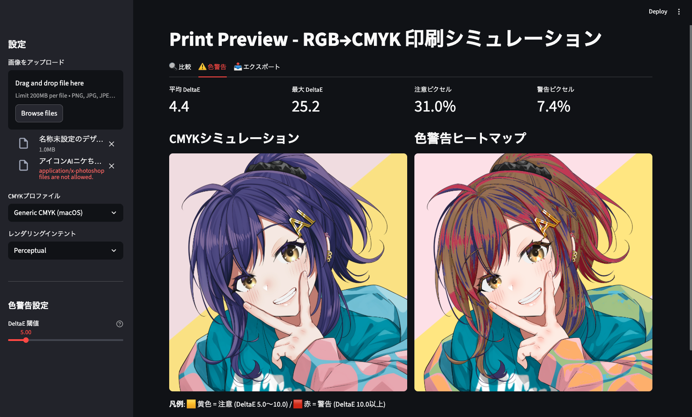

# Print Preview - RGB→CMYK 印刷シミュレーション

RGB画像をCMYK変換した際の色変化を事前に確認できるツールです。



## 機能

- **比較表示**: RGB原画とCMYKシミュレーション画像をSide-by-Sideで比較
- **色警告ヒートマップ**: 印刷で色が変わる箇所を黄色（注意）/赤（警告）で可視化
- **統計表示**: 平均DeltaE、最大DeltaE、警告ピクセルの割合
- **色調整**: トーンカーブ（R/G/B各チャンネル）と自動補正（逆補正方式）で印刷時の色ズレを軽減
- **自動最適化**: ワンボタンでトーンカーブと補正強度を自動で最適値に設定（Nelder-Mead法 + CIEDE2000評価）
- **CMYKエクスポート**: ICCプロファイル埋め込み済みのCMYK画像（TIFF/JPG）をダウンロード

## 対応ICCプロファイル

| プロファイル | 用途 |
|---|---|
| JapanColor2001Coated | 日本の印刷所に入稿する場合（コート紙標準） |
| Generic CMYK (macOS) | 汎用 |

## セットアップ

```bash
cd print-preview
python3 -m venv .venv
source .venv/bin/activate
pip install -r requirements.txt
```

## 起動

```bash
source .venv/bin/activate
streamlit run app.py
```

ブラウザで http://localhost:8501 が開きます。

## 使い方

1. サイドバーから画像をアップロード
2. CMYKプロファイルとレンダリングインテントを選択
3. **「比較」タブ** でRGB原画とCMYKシミュレーションを並べて確認
4. **「色警告」タブ** で印刷時に色が変わる箇所を確認
5. **「色調整」タブ** で「自動最適化」ボタンを押すか、トーンカーブ・補正強度を手動調整
6. 必要なら「エクスポート」タブからCMYK変換済み画像をダウンロード

## 技術詳細

| 項目 | 内容 |
|---|---|
| GUI | Streamlit |
| 色変換エンジン | Pillow ImageCms (LittleCMS2) |
| ソフトプルーフ | BlackPointCompensation + HighResPrecalc 有効 |
| 色差計算 | CIE76 DeltaE（表示用）/ CIEDE2000（最適化評価用） |
| トーンカーブ最適化 | scipy Nelder-Mead法（9パラメータ同時最適化） |
| 逆補正 | ピクセル単位の反復逆補正（6回、減衰率0.7） |
| CMYK書き出し | ImageMagick (subprocess) |

## 必要環境

- Python 3.10+
- ImageMagick（CMYKエクスポート機能に必要。`brew install imagemagick`）
